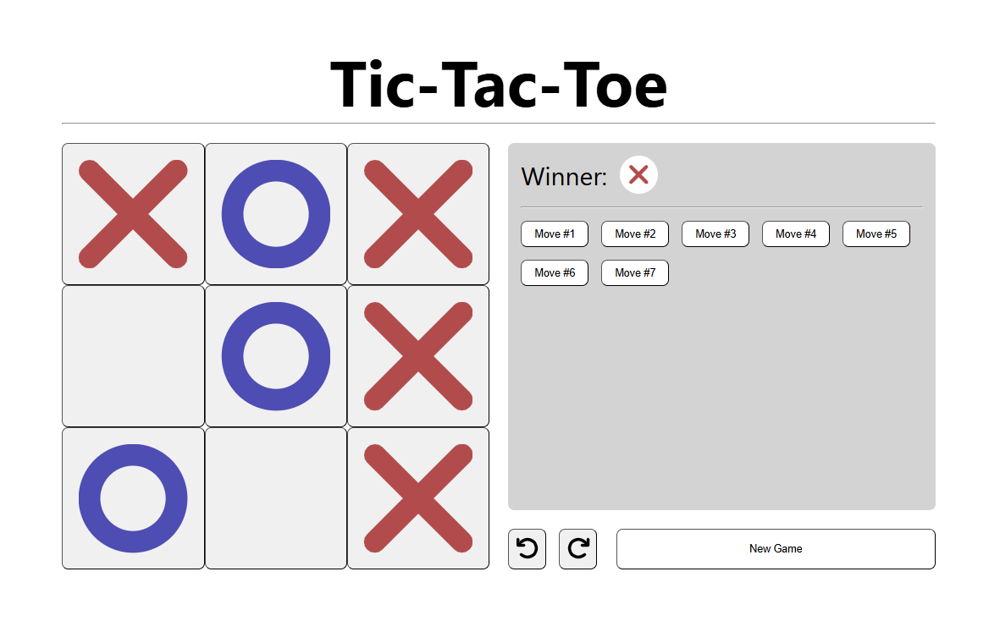

# Tic-Tac-Toe game using React

This game is a practice project to learn React and started from the [React Tic-Toe-Toe tutorial](https://react.dev/learn/tutorial-tic-tac-toe). The code is slightly altered since I used my own logic in some features.

## Screenshot


## Features
- Turn-based between `X` and `O`.
- Move history.
- Undo move to any point of the game.
- Winner check.

## Technologies
- HTML
- CSS
- ReactJS

## How to run the project
```bash
# Clone the project
git clone https://github.com/hasinajy/react-tic-tac-toe.git

# Switch to the project directory
cd react-tic-tac-toe

# Install all dependencies
npm install

# Run the game
npm start
```

## Contributing
Any contribution is welcome. Just make a PR and let's make the game more fun.

## License
The project is licensed under the MIT License. Refer to the file for more information.

## Author
Hasina JY